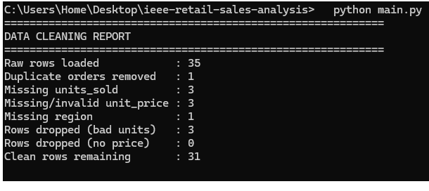
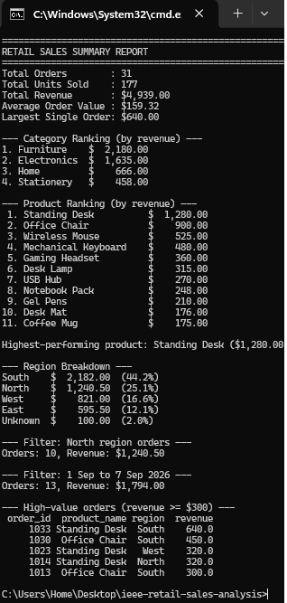

# Retail Sales Intelligence

### IEEE LGU AI/ML Cohort One — Fall 2026

**Week 3 Assignment:** Data Analysis with NumPy & Pandas
**AI/ML Leads:** Abdullah Faisal & Alina Irshad

---

## 1. Project Overview

This project analyzes a raw retail sales export containing missing values, duplicate orders and invalid prices/quantities. The script cleans the data, calculates revenue metrics with NumPy, ranks products, categories and regions with Pandas `groupby`, and prints a business summary report to the console.

## 2. Key Concepts Implemented

- [x] Pandas DataFrame Loading & Cleaning (`read_csv`, `fillna`, `dropna`, `drop_duplicates`)
- [x] NumPy Statistical Calculations (Sum, Max, Averages)
- [x] Data Grouping & Aggregation (`groupby`)
- [x] Conditional Filtering & Indexing (region, date range, high-value orders)
- [ ] Dataset Merging / Time-Series Resampling (not required for this project)

## 3. How to Run the Program

```shell
pip install pandas numpy
python main.py
```

## 4. Dataset Information & Cleaning Decisions

* **Data Source:** `data/sales.csv` was created by me for this assignment (35 rows, September 2026). It intentionally contains bad entries, based on the example in the assignment. All data is read with `pandas.read_csv()`; nothing is hardcoded.
* **Duplicate orders:** 1 duplicate row (order `1006`) was removed using `drop_duplicates(subset="order_id")`, because the same order must not be counted twice.
* **Invalid units sold:** Text values (`abc`), negative values (`-2`) and empty values cannot represent a real sale, so those 3 rows were dropped.
* **Missing / invalid prices:** Empty prices and a negative price (`-18.0`) were replaced with the **median price of the same product**. A product's price is usually the same across orders, so this is more accurate than a global average.
* **Missing region:** Filled with `"Unknown"` so the order's revenue is still counted in totals.
* **Result:** 35 raw rows → 31 clean rows.

## 5. Console Output Screenshots

**Data cleaning output:**



**Summary report:**


